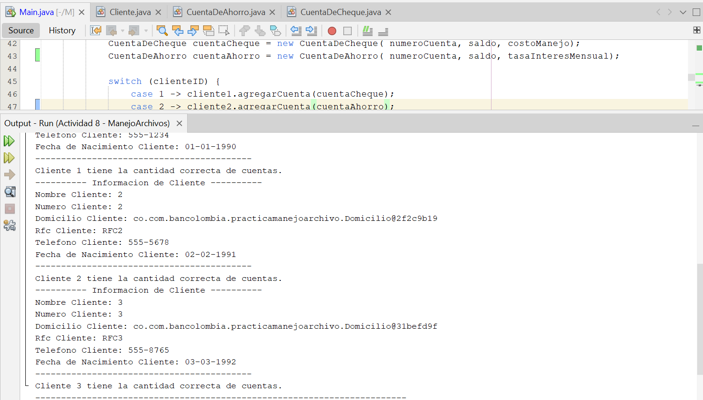

# **Practicas Curso Java Developer**

## Introduccion 🚀

En el presente repositorio se encuentran los ejercicios desarrollados para el curso de Java Developer, donde se llevan a
cabo los ejercicios donde se va implementando y practicando los conocimientos obtenidos en clase

## Evidencia Ejecución Ejercicio 8

## Versionamiento 📌

Se utilizó Git para el control de versiones 🔀

## Autor ✒

- **Cindy Elena Guzmán Ortiz** - [cindyortiz12323@gmail.com](#CindyGuzman)
